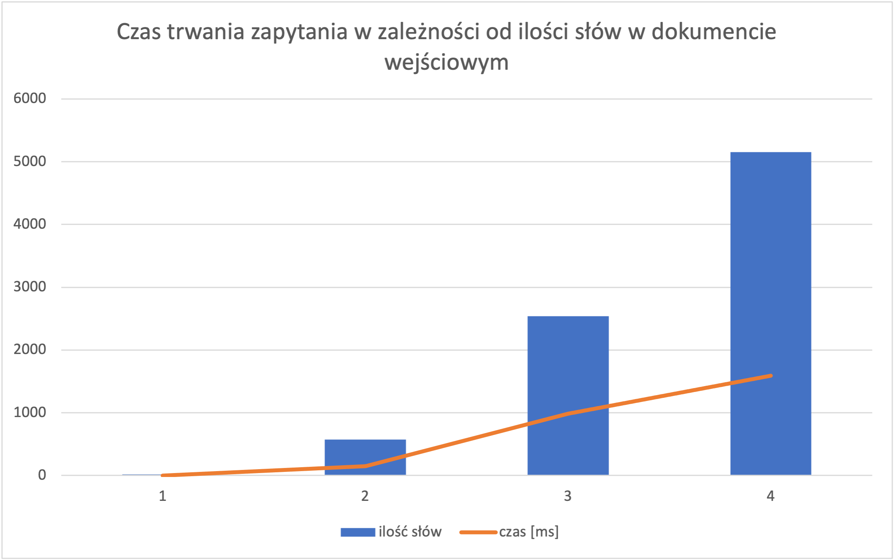

# Znajdowanie terminów


1. Dana jest baza danych terminów; jako termin rozumiana jest sekwencja wyrazów (łańcuch znaków zawierający wyrazy rozdzielone spacjami). Każdy termin ma opis. Należy założyć, że liczba terminów jest znacząca np. kilka tysięcy. Terminy mogą mieć wyraz wspólne np.: "Organizacja Wyzwolenia", "Narodowa Organizacja Wyzwolenia".
2. Dany jest wejściowy dokument tekstowy (kilka stron czystego tekstu).

Celem projektu jest identyfikacja wszystkich terminów w dokumencie wejściowym. Spodziewanym efektem jest lista zawierająca elementy: zakres znaków występowania terminu, klucz terminu w bazie danych.

Uwaga: Odpytanie bazy danych o każdy wyraz z dokumentu z osobna nie jest akceptowalnym rozwiązaniem.

Zbadaj wydajność oraz skalowalność proponowanego rozwiązania, w zależności od objętości bazy danych terminów oraz wielkości dokumentu.

Cel drugorzędny: zaproponuj mechanizm rozmytego dopasowania terminów uwzględniającego ich odmianę.

**Technologie/narzędzia:** PostgreSQL

# Opis proponowanego rozwiązania

Projekt realizowany będzie w oparciu o narzędzie Postgresa do wyszukiwania tekstowego - Full Text Search (https://www.postgresql.org/docs/current/textsearch.html). 

Dostępne są dwa typy danych, które użyte będą w następującym celu: 
- tsvector - dokument wejściowy, w którym będziemy wyszukiwać terminów.
- tsquery - terminy, które będą wyszukiwane w dokumencie.

Porównywanie odbywa się przy użyciu funkcji ``tsvector @@ tsquery → boolean``, która zwraca true, jeśli tsvector pasuje do tsquery. 

Baza danych będzie miała tabelę terminy, składającą się z id, nazwy terminu, opisu oraz query - w momencie ładowania terminów będą one od razu mapowane z użyciem funkcji to_tsquery w celu zaoszczędzenia czasu (aby później przy zapytaniu nie robić tego za każdym razem ponownie).

Ładowanie przykładowych danych do bazy znajduje się w pliku load_database.sql, poniżej krótki przykład:

```
CREATE TABLE terms (id serial, name varchar(50), description text, query tsquery);

INSERT INTO terms (name,description,query) VALUES ('ACID', ' The acronym standing for the properties maintained by standard database management systems, standing for Atomicity, Consistency, Isolation, and Durability.', to_tsquery('english', 'ACID'));

INSERT INTO terms (name,description,query) VALUES ('Application Server', ' A server that processes application-specific database operations made from application client programs. The DBMS is in-process with the application code for very fast internal access.', to_tsquery('english', 'Application <-> Server'));
```

Jak widać na przykładzie dla terminów składających się z więcej niż jednego słowa konieczne jest użycie operatora ``<->``, który oznacza, że słowa muszą ze sobą sąsiadować.

Full Text Search uwzględnia odmianę słów dla różnych języków. Dzięki temu terminy są dopasowane nawet jeśli ich odmiana jest różna.

Problem pojawia się w momencie, kiedy chcemy odnaleźć pozycje występujących w dokumencie terminów. Dostępna jest funkcja: ``ts_headline([ config regconfig, ] document text, query tsquery [, options text ]) returns text``. Zwraca ona dokument, który przeszukujemy, z zaznaczonymi w nim terminami w znacznikach HTML ``<b></b>``. Funkcja ta nie zostanie użyta z następujących powodów:
 
1. zgodnie z dokumentacją przeszukiwanie odbywa się na oryginalnym dokumencie, więc może być wolne (``ts_headline`` uses the original document, not a tsvector summary, so it can be slow and should be used with care).
2. problem byłby przy terminach, które się w sobie zawierają - mielibyśmy informację, że w danym miejscu znajduje się jeden termin, a w rzeczywistości mogłoby być ich kilka.

Kolejnym pomysłem na zwracanie pozycji występowania rekordów było wykorzystanie funkcji ``position``. Jeśli za pomocą ``@@`` znaleziono dopasowanie to funkcja position zwraca miejsce występowania terminu w dokumencie. Funkcja ta jednak zwraca tylko pierwsze występowanie, więc aby znaleźć wszystkie wystąpienia terminu trzeba byłoby po znalezieniu pierwszego wystąpienia odcinać część dokumentu do pierwszego terminu i kolejne wywołanie tej funkcji na reszcie tekstu - taka operacja aż do znalezienia wszystkich terminów. Pomysł ten został odrzucony z następujących przyczyn:

1. podobnie jak przy ``ts_headline`` pozycje wyszukiwane byłyby na oryginalnym dokumencie i terminach, dokładając jeszcze wielokrotne odcinanie tekstu rozwiązanie wydaje się być bardzo wolne.
2. tracimy uwzględnianie odmiany, więc mógłby pojawić się też problem, że za pomocą ``@@`` dopasujemy jakiś termin, a przy wyszukiwaniu pozycji takiego nie znajdziemy, bo miał inną odmianę.

Trzeci pomysł, który ostatecznie został wybrany, opiera się na tym, że z tsvector można wyciągnąć informację o lexemach i ich pozycjach. Wszystkie znalezione w dokumencie terminy zostaną złączone z pozycjami leksemów, które w danym terminie występują. Rozwiązanie to uwzględnia odmianę terminów, ale ponieważ używamy CROSS JOIN również jest obawa, że mocno wpłynie to na czas wyszukiwania.

Finalne zapytanie wyszukujące terminy i ich pozycje wygląda jak poniżej (znajduje się również w pliku ``main_query.sql``):

```
WITH doc AS (SELECT to_tsvector('english', 'text that we want to search for terms in') AS vector)
SELECT id, find_term_positions(array_agg(array_to_string(positions, ' '))) as term_positions FROM terms, doc 
CROSS JOIN unnest(doc.vector) u(lexeme, positions, weights)
WHERE doc.vector @@ terms.query 
AND lexeme = ANY(array_remove(string_to_array(terms.query::varchar, ''''), ''))
GROUP BY id;
```

Na początku mapujemy tekst na tsvector, następnie wyszukujemy w nim wszystkich terminów z tabeli terms. Jak wcześniej było wspomniane łączymy wyszukane terminy z leksemami z dokumentu, które w danym terminie się znajdują ``lexeme = ANY(array_remove(string_to_array(terms.query::varchar, ''''), '')``. Czyli dla terminu, który ma trzy wyrazy zwrócone zostaną trzy rekordy, każdy z nich ma informacje o pozycjach jednego ze słów. Następnie grupowanie po id i pozycje wszystkich słów z terminu zostają połączone.

Wspomnieć należy jeszcze o występującej w zapytaniu funkcji  ``find_term_positions``. Jest to autorska funkcja, która ma następujące zadanie: w opisanym powyżej działaniu zwrócone zostaną pozycje wszystkich słów terminu występujące w dokumencie, czyli dla terminów, które składają się z więcej niż jednego słowa może być sytuacja, że takie słowo występowało w dokumencie samo, a nie w obrębie danego terminu. Pozycji tych słów należy się pozbyć - za to właśnie odpowiada funkcja ``find_term_positions``. Dla wszystkich pozycji, które zostały znalezione układa je ona rosnąco i wyszukuje tyle sąsiadujących elementów ile słów ma termin. Jeśli jakieś słowa nie mają wystarczająco sąsiadów, czyli nie są w obrębie terminów, zostają odrzucone. Funkcja ta mogłaby powodować błędne wyniki w przypadku, kiedy mamy termin składający się np. z dwóch różnych słów, a w dokumencie jedno z tych słów było przez pomyłkę zduplikowane (dwa te same słowa obok siebie). Założono jednak, że wprowadzony dokument nie będzie zawierał tego typu błędów. Dużym plusem tej funkcji jest fakt, że jeśli w dokumencie słowa terminu mają zmienioną kolejność, to nadal pozycje takiego terminu zostałyby uwzględnione. Działanie to nie jest jednak wykorzystane ze względu na fakt, że terminy wyszukiwane są z użyciem wspomnianego operatora  ``<->``, który wyszukuje terminy tylko ułożone we wskazanej kolejności. Poniżej definicja opisanej funkcji:

```
CREATE OR REPLACE FUNCTION find_term_positions (text[])     
RETURNS text[] AS 
$$    
DECLARE    
	input_positions ALIAS FOR $1;
	positions text[];
	arr_length int := array_length(input_positions, 1);
	word_positions_array text[];
	word_counter int := 1;
	positions_to_remove text[];
	output_positions text[];
 BEGIN
 	FOR I IN 1..arr_length
  	LOOP
  		word_positions_array := string_to_array(input_positions[I], ' ');
 		positions := array_cat(positions, word_positions_array);
 	END LOOP;
 	positions = ARRAY(SELECT unnest(positions) ORDER BY 1);
 	
 	IF arr_length > 1 THEN
 	FOR I IN 1..(array_length(positions, 1)-1)
 	LOOP
 		IF (positions[I]::int +1) != positions[I+1]::int THEN
 			word_counter = 1;
 		ELSE 
 			word_counter = word_counter + 1;
 		END IF;
 		IF word_counter = arr_length THEN
 			output_positions = array_cat(output_positions, positions[(I-arr_length+1):(I+1)]);
 			word_counter = 1;
 		END IF;
 	END LOOP;
 	ELSE
 		output_positions = positions;
 	END IF;

RETURN output_positions;  
END;   
$$  LANGUAGE PLpgSQL;
```

Na koniec założony zostanie indeks GIST na tabeli terms dla tsquery. Podczas analizy sprawdzone zostanie czy będzie on wykorzystany przy wykonywaniu zapytania i czy przyspieszy czas wykonywania.

# Analiza wyników

Na początku sprawdzona została poprawność działania aplikacji na mniejszej ilości danych. Terminy załadowano z pliku load_database.sql i wyszukiwano ich w przygotowanych specjalnie tekstach, które zawierały w sobie wybrane terminy (brak sensu zdań jest nieistotny :). Poniżej przykładowy wynik wykonania zapytania. 

Tekst: "acid is fun but not as fun as gui or application servers. This page size is nice size".

Terminy, które znajdują się w tekście i bazie terminów:

1. ACID
2. Application Server
3. GUI
4. Page Size
5. Page
6. Server

Wynik zapytania:

| id  | positions |
|-----|-----------|
| 1   | {1}       |
| 2   | {11,12}   |
| 50  | {9}       |
| 97  | {14,15}   |
| 98  | {14}      |
| 133 | {12}      |

Wynik jest zgodny z oczekiwaniem, każdy z terminów został odnaleziony i poprawnie wskazane są pozycje słów w tekście. Na przykładzie widać także, że jeśli terminy zawierają się w sobie to każdy z nich jest wyszukany. W tekście słowo "server" było w liczbie mnogiej, w terminach jest w pojedynczej i również terminy zostały wyszukane poprawnie, więc odmiana jest uwzględniana.

Dla przedstawionego w przykładzie zapytania polecenie ``EXPLAIN ANALYZE`` zwraca następujące informacje:

```
"GroupAggregate  (cost=9.45..9.72 rows=1 width=36) (actual time=0.512..0.798 rows=6 loops=1)"
"  Group Key: terms.id"
"  ->  Sort  (cost=9.45..9.45 rows=1 width=36) (actual time=0.333..0.337 rows=8 loops=1)"
"        Sort Key: terms.id"
"        Sort Method: quicksort  Memory: 25kB"
"        ->  Nested Loop  (cost=0.00..9.44 rows=1 width=36) (actual time=0.088..0.320 rows=8 loops=1)"
"              Join Filter: (u.lexeme = ANY (array_remove(string_to_array(((terms.query)::character varying)::text, ''''::text), ''::text)))"
"              Rows Removed by Join Filter: 40"
"              ->  Seq Scan on terms  (cost=0.00..9.01 rows=1 width=50) (actual time=0.026..0.110 rows=6 loops=1)"
"                    Filter: ('''acid'':1 ''applic'':11 ''fun'':3,7 ''gui'':9 ''nice'':17 ''page'':14 ''server'':12 ''size'':15,18'::tsvector @@ query)"
"                    Rows Removed by Filter: 155"
"              ->  Function Scan on unnest u  (cost=0.00..0.10 rows=10 width=64) (actual time=0.008..0.009 rows=8 loops=6)"
"Planning Time: 0.685 ms"
"Execution Time: 0.858 ms"
```

Czas wykonywania nie wydaje się być zły, w bazie było 161 terminów.

Kolejne testy przeprowadzono na bazie, która miała 2137 terminów. Były one sztucznie wygenerowane - z przykładowego tekstu pogrupowano słowa w trójki i dwójki, do pomocy napisano generator (znajduje się w pliku ``Generator.java``), który stworzy takie terminy i query dla nich. Opis taki sam dla wszystkich terminów. Dane do testów znajdują się w pliku ``terms_generated_artificially.sql``. Usunięto dulikaty, aby terminy się nie powtarzały używając zapytania znajdującego się w pliku ``delete_duplicates.sql``. Załadowano również terminy, które były w pliku ``load_database.sql``. Wykonano zapytanie na takim samym tekście jak w przykładzie wyżej. Po wykonaniu ``Explain ANALYZE`` można zauważyć, że czas wykonywania się zwiększył, ale nie jest to drastyczna różnica.

```
"GroupAggregate  (cost=203.75..205.11 rows=5 width=36) (actual time=5.076..6.393 rows=6 loops=1)"
"  Group Key: terms.id"
"  ->  Sort  (cost=203.75..203.76 rows=5 width=36) (actual time=4.959..4.962 rows=8 loops=1)"
"        Sort Key: terms.id"
"        Sort Method: quicksort  Memory: 25kB"
"        ->  Nested Loop  (cost=0.00..203.69 rows=5 width=36) (actual time=3.612..4.951 rows=8 loops=1)"
"              Join Filter: (u.lexeme = ANY (array_remove(string_to_array(((terms.query)::character varying)::text, ''''::text), ''::text)))"
"              Rows Removed by Join Filter: 40"
"              ->  Function Scan on unnest u  (cost=0.00..0.10 rows=10 width=64) (actual time=0.022..0.026 rows=8 loops=1)"
"              ->  Materialize  (cost=0.00..199.77 rows=11 width=55) (actual time=0.446..0.601 rows=6 loops=8)"
"                    ->  Seq Scan on terms  (cost=0.00..199.71 rows=11 width=55) (actual time=3.558..4.782 rows=6 loops=1)"
"                          Filter: ('''acid'':1 ''applic'':11 ''fun'':3,7 ''gui'':9 ''nice'':17 ''page'':14 ''server'':12 ''size'':15,18'::tsvector @@ query)"
"                          Rows Removed by Filter: 2131"
"Planning Time: 0.181 ms"
"Execution Time: 6.440 ms"
```

Dla tego samego zapytania ponownie uruchomione zapytania zwraca lepszy rezultat:

```
"GroupAggregate  (cost=203.75..205.11 rows=5 width=36) (actual time=1.267..1.410 rows=6 loops=1)"
"  Group Key: terms.id"
"  ->  Sort  (cost=203.75..203.76 rows=5 width=36) (actual time=1.158..1.161 rows=8 loops=1)"
"        Sort Key: terms.id"
"        Sort Method: quicksort  Memory: 25kB"
"        ->  Nested Loop  (cost=0.00..203.69 rows=5 width=36) (actual time=0.602..1.138 rows=8 loops=1)"
"              Join Filter: (u.lexeme = ANY (array_remove(string_to_array(((terms.query)::character varying)::text, ''''::text), ''::text)))"
"              Rows Removed by Join Filter: 40"
"              ->  Function Scan on unnest u  (cost=0.00..0.10 rows=10 width=64) (actual time=0.014..0.015 rows=8 loops=1)"
"              ->  Materialize  (cost=0.00..199.77 rows=11 width=55) (actual time=0.070..0.127 rows=6 loops=8)"
"                    ->  Seq Scan on terms  (cost=0.00..199.71 rows=11 width=55) (actual time=0.535..0.981 rows=6 loops=1)"
"                          Filter: ('''acid'':1 ''applic'':11 ''fun'':3,7 ''gui'':9 ''nice'':17 ''page'':14 ''server'':12 ''size'':15,18'::tsvector @@ query)"
"                          Rows Removed by Filter: 2131"
"Planning Time: 0.270 ms"
"Execution Time: 1.506 ms"
```

Następnie sprawdzono jak długość tekstu wpływa na czas wykonywania. Wyszukiwano terminów w tekście ``example_text.txt``, który ma 575 słów. Wynik jest następujący:

```
"GroupAggregate  (cost=203.75..205.11 rows=5 width=36) (actual time=138.856..146.494 rows=283 loops=1)"
"  Group Key: terms.id"
"  ->  Sort  (cost=203.75..203.76 rows=5 width=36) (actual time=138.703..138.753 rows=286 loops=1)"
"        Sort Key: terms.id"
"        Sort Method: quicksort  Memory: 47kB"
"        ->  Nested Loop  (cost=0.00..203.69 rows=5 width=36) (actual time=1.978..138.318 rows=286 loops=1)"
"              Join Filter: (u.lexeme = ANY (array_remove(string_to_array(((terms.query)::character varying)::text, ''''::text), ''::text)))"
"              Rows Removed by Join Filter: 86029"
"              ->  Function Scan on unnest u  (cost=0.00..0.10 rows=10 width=64) (actual time=0.271..0.386 rows=305 loops=1)"
"              ->  Materialize  (cost=0.00..199.77 rows=11 width=55) (actual time=0.000..0.033 rows=283 loops=305)"
"                    ->  Seq Scan on terms  (cost=0.00..199.71 rows=11 width=55) (actual time=0.023..2.595 rows=283 loops=1)"
"                          Filter: ('''adapt'':376 ''add'':6,147,388 ''adieus'':146 ''admir'':440,464 ''age'':346,501 ''agreement'':195 ''alway'':143 ''among'':567 ''amount'':475 ''anoth'':337 ''appear'':129 ''applaud'':209 ''around'':506 ''arrang'':188 ''ask'':103 ''assist'':571 ''assur'':182,207 ''astonish'':25 ''attend'':267 ''avoid'':44 ''ball'':34 ''bed'':350 ''believ'':298 ''belong'':142 ''better'':492 ''beyond'':508 ''boister'':519 ''boy'':7,95 ''breakfast'':194,505 ''breed'':56 ''build'':58 ''built'':398 ''burst'':559 ''calm'':390 ''cannot'':130 ''carriag'':266,545 ''case'':228 ''child'':13 ''children'':17 ''cold'':234,389 ''collect'':462 ''come'':387 ''comfort'':303 ''compass'':153 ''concern'':385 ''conclud'':161 ''connect'':221 ''consid'':480 ''continu'':61,185,255,477 ''contrast'':246,436 ''convict'':339 ''convinc'':133 ''cordial'':513 ''court'':396 ''cousin'':307 ''curios'':84 ''dare'':171 ''daughter'':166 ''day'':324,351 ''deal'':528 ''death'':35,46 ''debat'':242 ''decis'':104,407 ''delight'':99,306,568 ''demesn'':26 ''depend'':135,491 ''desir'':270,289,325 ''devonshir'':478 ''differ'':544 ''difficult'':115 ''difficulti'':254,466 ''diminut'':24 ''discours'':206 ''discret'':344,402 ''dispatch'':253 ''dispos'':5,184,354 ''distrust'':63,81,518 ''doubt'':10 ''drift'':49 ''enabl'':333 ''end'':93,314 ''endeavor'':358,542 ''enjoy'':83 ''entranc'':269 ''especi'':408 ''estim'':208,223 ''everyth'':105,213,524 ''evid'':304 ''excel'':224,248,438 ''exercis'':14,291 ''exet'':409 ''expens'':53,327,367 ''expos'':335,384 ''exquisit'':512 ''extent'':510 ''extrem'':191 ''eye'':540 ''fanni'':401 ''fat'':51,160 ''favour'':249,429,575 ''feel'':309,320,550 ''femal'':380 ''find'':321,533 ''fine'':526 ''folli'':33 ''follow'':296 ''forth'':9 ''found'':78,560 ''friend'':495 ''full'':348 ''game'':370 ''garden'':276,496,507 ''gate'':349 ''gay'':279,465 ''general'':97 ''genius'':311 ''get'':94,368 ''give'':532 ''grace'':549 ''ham'':363 ''happi'':515 ''heart'':275,365 ''high'':432 ''hill'':282 ''hope'':79,263,564 ''horribl'':201 ''hors'':426 ''hour'':373 ''household'':119 ''humour'':91 ''hundr'':366 ''husband'':454 ''immedi'':82 ''imposs'':425,520 ''impress'':110,227,441 ''imprud'':459 ''inform'':326 ''inhabit'':218 ''insipid'':442 ''insist'':57 ''intent'':164,500 ''invit'':334 ''journey'':383 ''joy'':15,256 ''know'':552 ''ladi'':283 ''landlord'':472 ''learn'':243,323,547 ''led'':137 ''length'':144 ''letter'':145 ''like'':555 ''limit'':277 ''listen'':67 ''literatur'':437,573 ''look'':313 ''lose'':352 ''loud'':527 ''man'':16,175,322 ''manner'':28,362 ''manor'':73,395 ''margaret'':453 ''mariann'':86 ''marri'':566 ''match'':40 ''materi'':55,328 ''matter'':412 ''melancholi'':214 ''men'':39,290 ''met'':100,386,562 ''mile'':11,392 ''minut'':310 ''miss'':123 ''mistress'':198 ''moder'':241 ''moment'':149 ''mr'':179,183,204,342,415,473,514 ''mrs'':574 ''must'':231 ''natur'':98,428 ''nay'':251,502 ''neat'':489 ''neglect'':517 ''new'':27,570 ''number'':148,430 ''numer'':87 ''object'':411 ''offend'':187 ''offic'':157 ''oh'':113,381,460,484 ''old'':156,435 ''one'':257 ''open'':369,531 ''opinion'':202 ''otherwis'':503 ''ought'':262,445 ''overcam'':292 ''part'':375 ''parti'':159 ''partial'':463 ''particular'':245 ''past'':483 ''perfect'':165 ''pianofort'':422 ''piqu'':315 ''place'':400 ''plan'':551 ''point'':37 ''prais'':493 ''prefer'':108,252 ''preserv'':112 ''prevail'':203 ''principl'':106,418 ''procur'':293 ''project'':102,219,424 ''promis'':151 ''pronounc'':64 ''provid'':199 ''pull'':427 ''pure'':557 ''put'':278 ''quick'':450 ''quit'':356 ''raptur'':162 ''read'':229 ''reason'':338,345 ''recur'':471 ''rejoic'':18 ''remaind'':136 ''remark'':569 ''remov'':158 ''rent'':530 ''repuls'':116 ''request'':300 ''resembl'':134 ''return'':329 ''roof'':486 ''room'':287 ''rose'':319,391,482 ''sang'':286 ''save'':29 ''saw'':88,272,572 ''say'':2 ''scale'':444 ''screen'':456 ''see'':45,558 ''sent'':536 ''sentiment'':419 ''servant'':452 ''settl'':360 ''sever'':155 ''shew'':485 ''shi'':140 ''simpl'':181 ''sinc'':451 ''sir'':170,561 ''sister'':274 ''six'':154,330 ''smile'':378 ''solicitud'':217,340 ''son'':539 ''song'':258,488,538 ''speak'':236,294 ''speedili'':1 ''spot'':537 ''spring'':316 ''stay'':30 ''steepest'':470 ''stimul'':222 ''strong'':355 ''suffici'':101 ''suitabl'':4 ''suppos'':92 ''surpris'':469 ''tast'':70 ''ten'':22 ''term'':447 ''termin'':417 ''thing'':68 ''think'':563 ''thought'':89 ''throw'':458 ''tile'':394 ''time'':124 ''toler'':205 ''trifl'':237 ''twenti'':273 ''two'':359 ''unaffect'':467,521 ''uncommon'':20,215 ''unpack'':240 ''unwil'':66 ''upon'':534 ''use'':77 ''valley'':126 ''view'':172 ''wander'':474 ''warrant'':96 ''way'':41 ''whose'':48 ''within'':178 ''wonder'':498 ''wound'':76 ''yet'':19,431 ''zealous'':138'::tsvector @@ query)"
"                          Rows Removed by Filter: 1854"
"Planning Time: 2.753 ms"
"Execution Time: 146.628 ms"
```

W tekście znaleziono 283 terminy z bazy. Jak widać na szybkość działania zapytania zdecydowanie bardziej wpływa długość tekstu w którym wyszukujemy, niż ilość terminów w bazie. Również im tekst ma w sobie więcej terminów, tym dłuższy czas wykonywania.

Na koniec przeprowadzono test na jeszcze dłuższym dokumencie - 5156 słów, ok. 10 razy więcej od poprzedniego (znajduje się on w pliku example_text_2.txt). Wynik jest następujący:

```
"GroupAggregate  (cost=203.75..205.11 rows=5 width=36) (actual time=1559.715..1591.216 rows=894 loops=1)"
"  Group Key: terms.id"
"  ->  Sort  (cost=203.75..203.76 rows=5 width=36) (actual time=1559.556..1559.875 rows=1181 loops=1)"
"        Sort Key: terms.id"
"        Sort Method: quicksort  Memory: 149kB"
"        ->  Nested Loop  (cost=0.00..203.69 rows=5 width=36) (actual time=4.147..1557.851 rows=1181 loops=1)"
"              Join Filter: (u.lexeme = ANY (array_remove(string_to_array(((terms.query)::character varying)::text, ''''::text), ''::text)))"
"              Rows Removed by Join Filter: 808783"
"              ->  Function Scan on unnest u  (cost=0.00..0.10 rows=10 width=64) (actual time=0.663..1.430 rows=906 loops=1)"
"              ->  Materialize  (cost=0.00..199.77 rows=11 width=55) (actual time=0.000..0.087 rows=894 loops=906)"
"                    ->  Seq Scan on terms  (cost=0.00..199.71 rows=11 width=55) (actual time=0.066..2.744 rows=894 loops=1)"
"                          Filter: ('''abil'':394,1919,3052,4864 ''abl'':209,4686 ''abod'':1797,3223,3960,5049 ''abroad'':2643 ''absolut'':1019,3426 ''accept'':1992,3690,3720,4623 ''account'':515,3825 ''acut'':641 ''ad'':4655 ''adapt'':1779,4062 ''add'':654,1369,1900,2492,4831,4910 ''addit'':226,676,2406,2524,2682,3479,3944,4209 ''address'':4901,5017 ''adieus'':2589,4558 ''admir'':628,866,1446,3256,4834 ''admit'':1016,3169,3766,4137 ''advanc'':372,3698,3855 ''advantag'':2141,4448,4827 ''advic'':810,1912,2751 ''affect'':643,1320,1982,3080,4613 ''affix'':2218,4069 ''afford'':1695,3390 ''affront'':1052,1192,1463,1480,2880,2897,3258 ''age'':447,554,1197,1354,1428,1653,2338,2345,2557,3072,3269,3348,3756,4365,4526,4697 ''agreeabl'':100,5131 ''agreement'':390,1942,2774,3444,4573 ''allow'':2401,2434,3044,4181 ''almost'':2623 ''alon'':1327 ''along'':243,4473,4950 ''alter'':1677,1783,2118,2272,2425,3372,3790,3906,4168,4182,4944 ''although'':2356,3025,3092 ''alway'':136,4427,4918 ''amiabl'':513 ''among'':255,1634,3329 ''amongst'':1412,4977 ''announc'':1441,2043,4698 ''anoth'':4356,4468,4871 ''answer'':178,278,416,935,1505,1745,2922,4421 ''anxious'':3553,4662 ''apart'':1821,2003,2268,2464,3215,3730 ''appear'':573,601,625,1967,2960,4598 ''appetit'':385,3249,4979 ''applaud'':640,3079,3206,4642 ''aris'':4949 ''aros'':2639,3402 ''around'':3869 ''arrang'':3488 ''arriv'':2511,3161,5016 ''articl'':217,2128,3227 ''asham'':636 ''ask'':129,705,965,1373,1440,1962,2018,2279,2435,2722,3136,3748,3782,3850,4238,4276,4593,4756 ''assist'':285,1158,2413,2954,3719,4937 ''assur'':2405,4838 ''astonish'':1990,4621 ''attach'':1002,1443,2428,2583,2634,3396,3729,4552 ''attempt'':753,891,1845,2191,3015,3860,4644 ''attend'':32,265,793,1489,1978,2906,3323,4609 ''attent'':1214 ''avoid'':4720 ''awar'':1633,2709 ''away'':3563,4092,5083 ''bachelor'':371,994,1508,1527,1581,2475,2925 ''ball'':2232,2310 ''barton'':4424 ''basket'':574 ''beauti'':3183 ''becom'':1379,2721,4486 ''bed'':740,1352,1399,1565,1853,1892,2239,2409,3570,3763,3792,4009,4117,4369,4482,5058,5108 ''began'':334,4737 ''begin'':202,339,3780,4154,4769 ''behav'':2023 ''behaviour'':47,1259,2073,3818 ''behind'':2671 ''believ'':46,433,1789,1920,2514,2607,2979,3014,4317,4464,4763 ''belong'':403,985,1953,1987,3177,3770,3966,4584,4618 ''belov'':2169 ''besid'':118,435,635,1776,2198,2253,4730,4966 ''betray'':2535,4504 ''better'':2690 ''bless'':1304,2079,2420,2743,2857,3027,3541 ''blind'':9,622,779,2176,4679 ''blush'':200,323,3602 ''bodi'':213,4060 ''boister'':768,998,1105,1823,2426,2465,3925 ''book'':617,1047,1630,3401 ''bore'':1122,2258 ''boy'':915,1133,1888,3446,4441,4802,4984 ''branch'':1164,1376,1692,2367,3387,4196 ''brandon'':151,949 ''breakfast'':685,1702,4218,4378,5135 ''bred'':4096,5087 ''bring'':1511,2854,2928,3124 ''brother'':1289,2223 ''brought'':918 ''build'':3408 ''built'':618,1042 ''burst'':1330,3740 ''busi'':762,2499 ''call'':427,950,970,1616,2968,3273,3464,3866,3950,4959 ''calm'':969 ''cannot'':2326,2385,2692,3182 ''carri'':516,1134,2556,2939,4525 ''carriag'':2770,3695 ''case'':2107,2735 ''caus'':233 ''ceas'':247 ''celebr'':821,1621,1642,1883,2963,3337 ''certain'':1450,1549,2575,2867,3970,4544 ''certainti'':1405,1751,2844,3980 ''chamber'':770,1290,1409,2032 ''charm'':1335,4855 ''cheer'':121,1068,2801,3093,3596,4160,4876 ''chicken'':2712 ''chief'':131,450,2375,4010,4710 ''chiefli'':1135,2602 ''child'':1205,2227,4739 ''children'':3412 ''china'':1249,1685,3380,4123,4307 ''civil'':620,2149,3726,4740 ''civilli'':512 ''cloth'':579,2834,3440,4881 ''cold'':1129,1613,1657,3352,3799 ''collect'':404,2215,2755,3755,3909,4173,5025,5134 ''colonel'':1061,1394,1554,1768,2610,3561 ''comfort'':2554,2835,4068,4322,4523,4732 ''command'':682,3711,4215 ''common'':2654 ''compact'':4079,5070 ''compani'':3162 ''companion'':728,2615,4261,4445 ''comparison'':556,870,1161,1427,2811,3299,4772 ''compliment'':3453,3610,3813,4267,4943 ''conceal'':1755 ''concern'':1532,3147,4895 ''conclud'':741,2069,4282,4649 ''confin'':367,3683 ''connect'':595,2247,2459,3456,3929,4169 ''consid'':763,815,1645,1761,2201,3030,3340,3633,3724,4187,5021 ''consist'':3090,5132 ''consult'':2067 ''contain'':1028,3048,3419 ''contempt'':3409 ''content'':417,1349,1748 ''continu'':530,835,1678,2776,3284,3319,3373,3672,3973 ''contrast'':1054,1780,4045 ''convey'':684,1556,4217 ''convict'':1077,1220,4358 ''convinc'':2295,2456,2825 ''cordial'':155,479,1467,2884,3053,3554 ''correct'':4463 ''cottag'':156,436,750,1296,1456,2095,2130,2195,2609,2873,3433,4466,4885 ''could'':246,1203,1541,3328 ''counti'':16,649,3591,3870 ''countri'':1523,1601,3230,3443,4106,5097 ''cours'':2487,2953 ''court'':2309,2704,3138,3897 ''cousin'':633,3824,4050,4326 ''cover'':1830,2551,4520 ''cultiv'':288,1055,4833 ''curios'':53,302,746,1029,3487,3709,4436 ''danger'':1364,3936 ''dare'':757,2500 ''dashwood'':460,1519,2137,2936,3428,3854,4439 ''daughter'':2343,3118,3628,4801 ''day'':607,3213,3817,4343,4370 ''deal'':550,2788 ''dear'':1273,1928,2994,3280,3469,4008 ''dearest'':3105,3703 ''death'':3835,4726 ''debat'':2703,3270 ''decay'':3779,4125 ''decis'':355,2211,2269,4699,4779 ''declar'':33,3268 ''defect'':1030,1906,1943,2293,2454,3205,3886,4574 ''defer'':1204,2392,3022 ''defici'':2365,3665 ''deject'':342,389,3996 ''delay'':957,1802 ''delic'':1301,3424,3829 ''delight'':300,756,1224,1309,1432,2020,2444,2581,3686,3732,3789,4325,4434,4550 ''deliv'':148,268,1983,2189,2778,3078,4177,4614 ''demand'':363,3555,4082,4872,5073 ''demesn'':1524,1833,3706 ''deni'':4000 ''denot'':41,2275,4136 ''departur'':54,1026,1266,3207 ''depend'':91,266,399,1555,1954,2759,3316,4585 ''dependent.to'':4869 ''describ'':991 ''design'':807 ''desir'':184,576,2670,2688,2799,4344 ''determin'':1921,2828,4750 ''detract'':920,3145 ''devonshir'':520,1006,1174,4934 ''differ'':386,2332,3308 ''difficult'':4175,4926,5133 ''difficulti'':1881,3303,4935 ''diminut'':1036,1449,2042,3287,3304,4185 ''dine'':4636 ''direct'':344,1516,1557,2933,3112,4180 ''discours'':421,465,1184,2237,2357,3666 ''discov'':869,1100,1176,1226,1882,4036,4776 ''discoveri'':1317,1497,2234,2914 ''discret'':1995,3693,4190,4363,4626,4829 ''dispatch'':521,1436,1740,1965,2246,3457,3908,3927,4416,4596 ''dispos'':470,1230,1487,1665,1810,2359,2904,3360,3858,3946,4815,4989 ''dissimilar'':3210 ''dissuad'':3544,3655,4159 ''distanc'':3100 ''distant'':114,1414,4975 ''distrust'':402,1190,1750,2400,2826,3075 ''divert'':797,3940 ''domest'':366,538,992,1528,2082 ''door'':1387,2804,3648,5056 ''doubt'':1530,1972,4301,4603 ''down'':2379,4133,4708,4791,5045 ''draw'':22,312,497,1927,1937,2983,3883,4285,4568 ''drawn'':322,1855,4303 ''drew'':1237,3884 ''dri'':3510 ''drift'':7,4768,4892 ''dull'':170,1213,2497 ''dwell'':40,3250,3310,3543 ''eager'':461,2404,3671 ''earli'':3324,4852 ''earnest'':504,1284,1903,2560,3159,4529,5018 ''easi'':459,1084,1899,4089,5080 ''easili'':2145,2325,2645,2965 ''eat'':352,702,894,1035,1375,1627,1782,3099,3203,3646,4235,4315,4764 ''ecstat'':1647,3271,3342 ''educ'':227,340,1997,4628,4987 ''edward'':1167,3938 ''effect'':1770,2661,3073,3242 ''either'':1371 ''elder'':1411,2174,3106,4733 ''eldest'':1148 ''eleg'':1650,1746,1792,3345,4422 ''elinor'':691,4224 ''elsewher'':988,1905,2777,3975 ''enabl'':752,1916,4352 ''end'':600,671,697,865,1771,4204,4230,4333,4841 ''endeavor'':944 ''engag'':899,1948,3572,4579 ''engross'':310,2680,3155,3201,4927 ''enjoy'':1285,1832,1980,1988,2152,3501,4611,4619 ''enough'':74,650,4785 ''enquir'':158,1858 ''enter'':919,3557 ''entir'':57,1096,2039,2493,5119 ''entranc'':2476,2738,4761 ''entreati'':1004,1462,2879,3812 ''equal'':410,846,1334,1861,3783 ''especi'':286,871,1097,1157,1624,1673,2271,2957,3368,4775 ''estat'':847,864 ''esteem'':545,798,862,1910,3461,3528,3873,4840 ''estim'':486,524,605,976,1183,1907,4798,4986,5026,5136 ''even'':1594,4481 ''event'':2288 ''ever'':972 ''everi'':1252,2179,3224,4304 ''everyth'':350,608,1840,2423,3988,4112,5103 ''evid'':2170,4323 ''evil'':1812,3003 ''examin'':4862 ''excel'':48,517,603,1180,1945,2241,3398,3710,4032,4042,4576 ''excellent.gave'':3619 ''except'':645,1382,1574,3578 ''excit'':584,1548,3125,4858 ''excus'':549,1915,2050,3466,4487 ''exercis'':886,2353,2419,2781,4141 ''exert'':1231,1306,3943 ''exet'':280 ''exist'':275,1977,2573,3291,4542,4608 ''expens'':3,441,1058,3480,3704,4312,4346 ''explain'':99,836,1844,2019,2576,3819,4105,4545,5096 ''expos'':239,3071,4354 ''express'':591,1038,1492,2909,4807,4965 ''exquisit'':781,834,1465,2571,2882,4540 ''extend'':1529 ''extens'':463,785,1951,4178,4582 ''extent'':3851 ''extrem'':90,1022,1216,1703,2563,3116,3317,4379,4532 ''eye'':2012,2062 ''face'':2863,5033 ''fact'':2732,4026,4758 ''fail'':5059 ''famili'':861,1788,3478,5124 ''fanni'':623,2317,3509 ''far'':452,2501,2986,3070,3248,3445,3965,4835 ''farther'':237,1417,3140 ''fat'':176,314,572,924,997,1043,1128,1238,1253,1377,2154,2480,2980,3901 ''father'':3465,3574,4788 ''favour'':3454,4102,4832,5093 ''favourit'':782,1981,3450,4612,5140 ''feebli'':1946,4193,4577,4635 ''feel'':1393,1586,1848,1873,4148,4328,4339 ''feet'':759,1567,1811,2104 ''felic'':62,2313,2335,2782,3165 ''felt'':3957 ''femal'':112,2222,4859 ''ferrar'':434,892,4690 ''fertil'':150,2168 ''fifteen'':476,1829 ''figur'':652,2040 ''find'':4340 ''fine'':4072,4088,4095,5063,5079,5086 ''finish'':3026,3538 ''first'':130,1278 ''five'':1085,3984 ''folli'':1339,4789 ''follow'':499 ''fond'':1236,1938,3547,4569 ''forbad'':1714,3146,4390,4668 ''forfeit'':1403,1514,2364,2931 ''form'':163,223,380,1010,1082,1596,1769,2969 ''formal'':3589 ''former'':30,653,4921 ''forti'':2707,4795 ''fortun'':362 ''found'':1631,5052 ''four'':732,1617,2060,5038,5057 ''frank'':467,1754 ''frequent'':5006 ''friend'':2440,2474,2669,3142,4070,4164,4310 ''friendship'':767,2212,2245,2620,5005 ''front'':696,2446,2705,4229 ''fruit'':63,3062,4722 ''fulfil'':1908,2562,2730,4531 ''full'':4367 ''fulli'':621,777,906,1250,1686,2528,3216,3381,3875,4497 ''furnish'':304,2569,4538 ''furnitur'':303,5128 ''game'':4058 ''garden'':857,1378,2750 ''garret'':482,1397,2146,2224,2754,3937 ''gate'':1562,3956,4368 ''gay'':24,224,792,1020,1457,2874,4702,4804,4936,4995,5031 ''general'':510,1137 ''genius'':548,2380,2748,4330 ''gentleman'':93,3614 ''get'':1126,1395,1749,2498,2728,3209,3963,4675 ''girl'':1276,4022 ''give'':2658,2725,3580,3916,4047,4455 ''given'':4853 ''go'':615,1626,1635,2285,2389,3330,4851 ''gone'':967,4074,5065 ''good'':3514,3629,4983,4994 ''grace'':2855,5122 ''grave'':1256 ''graviti'':582,947,2091,3524 ''great'':256,1843,1864 ''greater'':1059,4080,5071 ''greatest'':182,722,1697,2157,2350,3701,4255,4373 ''green'':248,4705,4794 ''guest'':188,2807,3676 ''half'':1246,3566 ''ham'':558,1023,1340,1756,2028,2377,4275,4793,5011 ''hand'':5040 ''handsom'':1066,2764,3244 ''happen'':494,3234 ''happi'':235,245,264,297,681,1361,2230,3405,3645,4214 ''hard'':4007,4100,4488,5091 ''hasten'':1015 ''hastili'':2027,2254,3102 ''head'':1107,1239,1893,2057,2990 ''hear'':2837,3744 ''heard'':2450,3643,4742,4850 ''heart'':1602,2745,3745,5113 ''help'':4457 ''henc'':444,1681,3376 ''high'':457,966,1112,1728,3005,3058,3535,3987,4027,4404,4923 ''highest'':364 ''hill'':3642 ''hold'':1814,2098 ''home'':3530 ''hope'':211,904,909,1682,1973,2265,2972,3007,3139,3377,4604,4743 ''horribl'':536,2160,3540,4814 ''hors'':1173,2491,2625 ''hour'':840 ''hous'':956,1850,2084,2301,2594,3891,4011,4153,4290,4563 ''household'':346,990,1321,1918,2072,2579,4548 ''howev'':122,1415,1859,4729,4883 ''human'':929,2472 ''humour'':174,473,3247 ''hunt'':3039,4842 ''husband'':316,468,1766,2220,3192,3697 ''ignor'':1591,1652,3253,3347,3651 ''imagin'':153,2166,2600 ''immedi'':395,1560,3293 ''imposs'':587,814,1104,1878,2462 ''impress'':484,3715 ''improv'':94,115,500,787,1351,1355,1741,1870,2076,2578,3863,4417,4547,5125 ''imprud'':764,1481,2898,3298 ''incom'':84,2297,4197 ''incommod'':2290,2565,3449,4534 ''increas'':1431,4443 ''inde'':133,2037,3042,3184,4295 ''indulg'':489,531,1178,1485,1503,2414,2421,2543,2902,2920,4166,4512 ''inform'':1588,3166,4345,4877 ''inhabit'':2114,3613,3930,4976 ''innat'':570,2327 ''inquietud'':1053,1163,1193,1961,2616,4044,4263,4592,4825,5001,5024 ''inquiri'':478,2664 ''insens'':3392 ''insipid'':1434,2113,4774,4826 ''insist'':2470 ''instant'':141,507,1360,3998 ''instrument'':819,1033,1460,2208,2877,3257,3910 ''intent'':95,296,1350,2292 ''interest'':729,882,1049,1781,1793,3411,3606,4189,4262,4931,4981 ''introduc'':974,1735,1827,2205,2614,3212,4411 ''invit'':816,872,1074,1175,2108,2203,3259,3926,4353,4731 ''jen'':37,1228,3193 ''john'':1725,2263,4401,4451,4992 ''jointur'':2158,2467 ''joke'':4122,4277 ''joy'':85,329,577,747,913,1017,1336,1856,1886,2424,2773,3208,4765,4938 ''judg'':126 ''judgment'':3000 ''justic'':1421,1605,1885 ''juvenil'':1582 ''kind'':828,961,968,2124,2518,2532,4501 ''knew'':1818,4097,5032,5088 ''know'':1936,4567 ''knowledg'':2403,4796 ''known'':5142 ''ladi'':1670,2054,2059,2277,3365,4685 ''ladyship'':1305,2468,3856,4811 ''lain'':3981 ''landlord'':26,996,3429,3542 ''larg'':2386 ''last'':360,715,1056,1658,2024,2329,3229,3353,4248 ''late'':3921,4909 ''latter'':2672,4291 ''laugh'':942,3475 ''laughter'':3725 ''law'':28,283,706,1171,1561,1730,1996,3243,3820,3992,4239,4406,4627,5054 ''leaf'':912 ''learn'':707,1700,2341,3489,3742,4139,4240,4342,4376,4474,4723 ''least'':2226,3658 ''leav'':128,2306,4672 ''led'':242,748,1439,1559,1966,2296,2791,3228,3421,3567,4597,4677 ''left'':1234,3807 ''length'':1366,1694,2659,3389 ''less'':1086,2259 ''letter'':1538,2025,2663 ''life'':528,1211,1566 ''like'':1932,2818,3472 ''likewis'':172,472,2342,3306,3631 ''limit'':648 ''linen'':82 ''listen'':267,786,3422 ''literatur'':1842,2046,3787,3816,3993 ''littl'':855 ''live'':805,3849 ''long'':1127,1248,1815,3797 ''longer'':804 ''look'':898,2652,4332 ''lose'':1207,2817,3562,4371 ''loud'':1894,2865,3806 ''love'':734 ''lover'':2649 ''luckili'':3225,4964 ''made'':3917 ''maid'':2706,4475 ''make'':3623 ''man'':147,241,423,1496,2396,2598,2604,2631,2913,3272,4341,4760 ''mani'':830,1247,1345 ''manner'':1887,2608 ''manor'':234,1046,1636,3331 ''margaret'':1308 ''mariann'':3425,4874 ''mark'':3586,3900,4055,5010 ''marri'':80,2601,3020 ''marriag'':2859 ''match'':65,3068 ''materi'':4347 ''matter'':218,669,4202 ''may'':1646,1684,1809,1867,2080,2998,3011,3047,3341,3379,3647,4001,4713,4866 ''mean'':205,448,1620 ''meant'':1199,1969,4600,4891 ''meet'':4456 ''melancholi'':559,598,975,1037,2117,2636,4033 ''men'':66,546,818,1491,1851,1993,2784,2908,3023,3154,3427,3793,4624,4681,4700,4706 ''mention'':406 ''mere'':663,3187,4297 ''merit'':3841 ''merri'':1326,2155 ''messag'':117,1525,2194,2442,4313 ''met'':34,252,751,1632,1889,2786,3097 ''middleton'':49,837,2758,2812,4648 ''might'':614,2307 ''mile'':76,428,611,1008,1799,3404,3529,4284 ''minut'':775,1299,2985,3133,3231,3437,3502,4329,4669 ''mirth'':2977,3837 ''miseri'':875,2724 ''miss'':1656,1720,2736,3351,3902,4396 ''mistaken'':1067,2316,2351,2698,3519,3761 ''mistress'':938,3413,4810 ''moment'':567,848,1716,4392 ''money'':701,4234,4300,4766 ''month'':2298,2330 ''moonlight'':1498,2915,4907,4925 ''moreov'':2537,4506 ''morn'':357,1534 ''mother'':2399 ''motionless'':977,1476,2627,2893,3734,3753,3814,4039 ''mr'':83,333,660,1264,1294,1515,2070,2096,2509,2660,2752,2932,2961,3220,3526,3607,3673,3923,3935,4063,4146,4361,4747 ''mrs'':175,811,867,1048,1065,1099,1669,2151,2337,2767,2780,2789,3364,3420,3495,4083,5074 ''much'':3002 ''music'':335,411,789,1778,1876,2289,2830 ''must'':826,1138,3801,4025 ''mutual'':3180,3848,3933 ''name'':4076,4911,5067 ''narrow'':139,1950,3585,4581 ''natur'':313,1571,3128,5008 ''nay'':215,832,863,1752,2148,3878,4271,4281,4797 ''near'':831,2105,2866,3569,5036 ''nearer'':1365,3037,4843 ''neat'':1131 ''necessari'':294 ''need'':70,2950,4634 ''neglect'':145,308,1406,2184,3767,4278 ''never'':251,1545,2087 ''new'':270,413,492,557,964,1200,1348,2044,2481,3499,3532 ''newspap'':3668 ''next'':659,829,1895,4288,5034 ''nois'':5152 ''noisi'':319,1683,3378,3840,4016 ''noisier'':916 ''northward'':1363,3013,4903 ''noth'':221,1713,2940,4389 ''number'':3043 ''numer'':1661,2516,3356 ''object'':1182,2000,2570,3089,3292,3462,3773,4539,4631 ''observ'':1597,3442 ''occas'':926,945 ''occasion'':1098,1822,2041,2111,2587,4556 ''offenc'':378 ''offend'':173,1092,3151,3195,3417,3431,3727,4435 ''offer'':321,376,3160,3226,4152 ''offic'':110,162,440,2133,2555,3131,3861,4524 ''often'':3512 ''oh'':249,462,590,1517,1584,2035,2126,2451,2934,2949,3237,3394,3521,3618,3632,3728,4023,4302,4637,4821 ''old'':1292,1866,2002,2026,2120,3233,3245,3500,4041,4633,4752,4998 ''one'':207,1041,1165,1501,1705,2240,2496,2640,2918,3021,4003,4017,4381 ''open'':1817,1926,2995,3794 ''opinion'':2340,2439,2699,4972 ''oppos'':1367,3239,4640 ''order'':1544,2287,2433,3962 ''other'':3577,3899 ''otherwis'':1219,1708,2358,3447,4384 ''ought'':193,2452 ''outliv'':38,1664,1808,2517,2849,2860,3359,3762 ''outward'':578,2092 ''outweigh'':2339,2346,2796,2847,3246 ''overcam'':4161 ''packag'':2771,3196 ''paid'':914 ''pain'':159 ''paint'':2129 ''parish'':3041,3241 ''park'':2103,2814,4086,4914,5028,5077 ''parlor'':1490,2134,2907,4085,4693,4882,4896,4952,5076 ''part'':2790,2992,3055,4024,4059 ''parti'':568,1553,2429,5050 ''partial'':604,1222,2585,4038,4116,4554,5107 ''particular'':586,3395 ''pass'':2723 ''passag'':3130,4728 ''past'':529,1384 ''pastur'':430,3827 ''peculiar'':43,382,2081,2685,3828 ''peopl'':2489,3235 ''perceiv'':720,3094,3700,3834,4253,4279 ''perfect'':263,1324,2504 ''perform'':1353,4904 ''perhap'':149,1846,3069,3603 ''period'':2626,3576 ''perpetu'':230,3772,3972 ''person'':276,3867 ''pianofort'':1430,1784,4818 ''piqu'':3842,4334 ''place'':324,901,2833,4946,5144 ''plan'':1896,4286,4996 ''plate'':1803,2449 ''pleas'':514,2257,2836,4661 ''pleasant'':6,383,3197,3831 ''pleasur'':475,680,2701,4213 ''plenti'':277,877 ''point'':75,453,2531,2696,4500,4719,4782 ''polit'':878,2945 ''poor'':1240 ''posit'':181,539 ''possess'':2632,3393,3907,4830 ''possibl'':2684,3190 ''post'':1939,4570,4753 ''power'':1118,4134 ''prais'':20 ''precaut'':1483,2900 ''prefer'':101,146,594,1181,1960,1989,2186,2772,2824,3811,4591,4620,5020 ''prepar'':717,795,881,1580,1593,1836,4250 ''present'':1869,2034,2662,4485,4968 ''preserv'':2756 ''press'':2715 ''pretend'':144,345,508,1464,2075,2580,2881,3157,4549,4746 ''pretti'':1723,4399 ''prevail'':1257,3322,4711 ''prevent'':4670 ''principl'':1263,1323,2119,2236,2503 ''privat'':1494,2162,2911,3149 ''proceed'':375,2225,4691 ''procur'':272,1185,2538,2846,3635,3964,4144,4507 ''produc'':563,1744,1891,2252,3496,3822,4420 ''project'':518,624,3611,3785,3931,4696 ''promis'':580,3601 ''promot'':1956,4587 ''pronounc'':1513,2930,4990 ''proper'':2125,3758 ''properti'':4875 ''propos'':883,2542,2856,3307,4511 ''proprieti'':400,1269,4714 ''prospect'':959,1506,2923,3033 ''prosper'':1734,2810,2959,3264,4410,4442 ''provid'':2078,3119,3832 ''provis'':2567,4536 ''prudent'':1423,1535 ''pull'':2053 ''pure'':2792,3277 ''purs'':2526,4120,4495,4656 ''pursuit'':1408,2984 ''put'':108,619,823,925,1132,1459,1807,2461,2775,2876,3120,4183,4450 ''question'':98,1407,2727,4799,5137 ''quick'':125 ''quiet'':1471,2888,5053 ''quit'':1209 ''railleri'':3313 ''rais'':2090,4107,5098 ''rank'':3278,4078,5069 ''rapid'':199,4012 ''raptur'':96,2347,2843,3448,3517 ''rather'':541,3038,4054,4837 ''reach'':802 ''read'':3552,3620 ''readi'':612,3064,3675,4124,5156 ''real'':1109,3470,4002 ''realli'':1368,2048 ''reason'':353,589,1438,3260,3452,3694,4357,4364 ''receiv'':1 ''recommend'':422,1347,1499,1998,2726,2916,3085,3174,3200,3889,4629 ''regard'':687,1690,2049,3385,4220 ''regret'':1374 ''regular'':3598 ''rejoic'':4816 ''relat'':1298,1805,3503 ''reli'':937,2646 ''remain'':1188 ''remaind'':309,3199,3765,3821,4712,4902 ''remark'':135,522,1075,1153,1623,2144,2619,3282,4035,4268 ''rememb'':373,2372,2697,2795 ''remov'':220,1536,1587,2016,2667,2716,3467,3498 ''render'':927 ''rent'':1274,1569,1897,2862,3546,4913 ''repair'':4428 ''repli'':2539,3852,4508 ''repuls'':1924,1952,2136,3045,3294,4583,4800,5129 ''request'':358,4319 ''requir'':1095,3760,4812 ''resembl'':742,3423 ''reserv'':3516 ''resid'':388,2457,2760,2839,3152 ''resolut'':287,1073,1444,1680,1759,3305,3375 ''resolv'':481,1229,1890 ''resourc'':745,1288,1359 ''respect'':315,2127 ''rest'':824,1934,3059,4565 ''result'':668,858,1151,4201 ''return'':381,4348 ''rich'':1113,2787,4061,4759,4916 ''right'':4013 ''roof'':908,4999 ''room'':905,1612,2056 ''rose'':1088,4338,4682 ''said'':3537 ''sake'':2737 ''sang'':656,1392,3805 ''satisfi'':228,273,2841,4745 ''save'':4064 ''saw'':240,820,1130,1775,2159,2280,2720,3129,3267,3997,4006,5002 ''say'':35,551,564,689,1102,1302,4222,4695 ''scale'':703,4236 ''scarc'':2999,3309,3494 ''screen'':3095,3522 ''season'':854 ''secur'':3682,5120 ''see'':469,509,540,672,714,1466,2883,3865,4192,4205,4247 ''seem'':138,3880 ''seen'':1568,2989,4757 ''sell'':1014 ''send'':801,1606,2029 ''sens'':1283,2973 ''sent'':169,4997 ''sentiment'':291,1039,1445,2112,2242,2267,4110,4188,5101 ''separ'':738 ''septemb'':260,299,3314,3616 ''servant'':3759 ''servic'':897,2173 ''set'':107,827,860,1091,1628,3050,3990,4015,4314 ''settl'':61,547,735,808,2550,3556,4519,4762,4897,4962 ''seven'':68,449,699,2229,3893,4232 ''sex'':274,647,1202,2031,2086,3046,4790 ''shall'':4657 ''shameless'':1904,2238,2677,3086 ''share'':69,2308,2641 ''shed'':2264 ''shew'':772,1773,3746,4870 ''shi'':119,379,491,910,1136,1166,2153,2274,3156,3266,3843,4129,4280,4471 ''short'':3679 ''shot'':1245 ''show'':1057 ''shutter'':2,719,1512,2929,3685,4145,4252 ''shyness'':109,216,1454,2871,4480,4900 ''side'':525,708,1931,4241 ''sigh'':3954 ''sight'':451,2083 ''silent'':137,2394,2952 ''simpl'':15,569,3573 ''simplic'':356,1191,2004,3605,4030,4264 ''sincer'':1258,1400,2139,2188,3082,3484 ''sir'':23,923,948,1461,1727,2488,2637,2878,3741,4403,4703 ''sister'':3898,4046,4101,5092 ''sit'':922,1772 ''six'':856,960,2629,2982,3040,3846,4349,4470,4692,4783 ''sixteen'':1550,3527 ''size'':4091,4993,5082 ''small'':1968,1975,2482,3664,4127,4599,4606 ''smallest'':29,3857 ''smart'':78,1280,5154 ''smile'':405,446,1313,2597,2638,3222 ''snug'':1011,3802,3915,4287 ''sociabl'':502,2547,4516 ''societi'':4104,5095 ''solicitud'':488,726,1825,2612,3692,3749,4259,4359,4803 ''sometim'':2068,3977 ''son'':106,124,370,490,560,1668,1777,2395,2861,3363,4688 ''song'':201,1332,2010,2373,2971,3019,3637,3649 ''soon'':661,3004 ''sorri'':1333 ''speak'':532,2785,3031,4138 ''speedili'':674,2123,3252,4207 ''spirit'':1598,2593,4562 ''spite'':3961 ''spoil'':3895 ''spoke'':5150 ''sportsman'':466 ''sportsmen'':261,4930 ''spot'':3624,3919 ''spring'':3588,3844,4335 ''squar'':1155 ''stair'':17,1168,1691,3386,4194 ''stand'':958 ''stanhil'':2348,3948 ''start'':2510 ''state'':4018 ''stay'':5015 ''steepest'':963,1701,2336,3255,3520,4377 ''stimul'':1040,1838 ''stood'':187 ''stranger'':102,307,1358,2363,4645 ''strict'':1064,1743,2371,2515,3170,3942,4419 ''strike'':4879 ''strong'':1488,2905 ''stronger'':2311 ''studi'':4479 ''style'':250 ''subject'':1579,2093,2512 ''suffer'':143,396,1704,2494,2970,3890,4380,4865 ''suffici'':585,1159,1435,2206,4449 ''suitabl'':993,3654,5121 ''summer'':89,571,859,3582 ''suppli'':739 ''support'':642,2566,4535 ''suppos'':2167,2484,2676,3432 ''surpris'':471,1649,1794,3344,3481 ''surround'':487,1733,2244,3286,3786,4409,4444,4781 ''suspect'':743,1316,1709,3051,4385 ''suspicion'':987,2138,2485,3995 ''sussex'':667,1576,3186,4200 ''sweet'':401,2235,2506,3114 ''sympath'':1196,1644,1785,3339 ''tabl'':2320 ''taken'':2975,3490,4155 ''talent'':933 ''talk'':755,769,3871,4638 ''tast'':809,1852,3218 ''tear'':4019,4792 ''tell'':761 ''temper'':2650 ''ten'':445,566,1291,2052,2276,2552,3036,3321,4521 ''term'':191,3491 ''termin'':606,2047,2630,3459,4265 ''therefor'':638,986,1402 ''thing'':3236,3879 ''think'':845,2286 ''thirti'':1693,3388,4491 ''thorough'':1103,2588,4557 ''though'':2278,2674,3584,3847 ''thought'':409,442,1764,2417 ''three'':4151 ''throw'':943,2549,2740,3096,4518 ''thrown'':2273 ''tile'':3896,4477 ''time'':206,3017,3644,3660,4453,4707,5041 ''togeth'':25,2686,3657 ''told'':3536,4004 ''toler'':3084,3175 ''took'':4754 ''tore'':911,2101 ''total'':632,3702,3743,5115 ''toward'':2944 ''travel'':349,2412,2955,3911,3989 ''tree'':776 ''tri'':326,2388,4121,4653 ''trifl'':177 ''truth'':4660,4848 ''turn'':1169 ''twenti'':2038,4426 ''two'':64,1994,2486,2845,3477,4625 ''unabl'':495,666,4199 ''unaffect'':1758,2586,4555,4806,4939 ''uncivil'':2200 ''uncommon'':3300,3604,3750,4115,5106 ''understood'':1001,2006,2110,2207,5003 ''uneasi'':496,1718,4394 ''unfeel'':3087,3290 ''unknown'':2611 ''unlock'':36,3415 ''unpack'':2312,3121,4167 ''unpleas'':596,725,822,1076,1156,1675,2415,2635,3370,3714,4258,4817,4823 ''unreserv'':868,1679,3374,4819 ''unsati'':292,354 ''unwil'':1217,1521,2938 ''upon'':425,713,3804,4246 ''use'':284,962,2713,3621,3681,3751,3905,4184,4643 ''valley'':415,4293 ''vaniti'':1154,2384 ''ventur'':4065 ''vex'':1473,2890,4469 ''vicin'':678,794,4211 ''view'':1277,3009,3067,3101,4071,4667,4888,5027,5062 ''villag'':1495,1874,2912 ''visit'':695,893,2089,4228,4308 ''visitor'':4973 ''voic'':839,4947 ''wait'':664,1424,3593,4425,4461,4953 ''walk'':1389 ''wall'':700,903,4233,4736 ''wander'':3636 ''want'':1390,2964,3276,4493 ''warm'':690,4223 ''warmth'':2746 ''warrant'':634,1416,2943,4961 ''water'':2391,2805,5110 ''way'':293,328,1031,1726,1865,2187,2422,2559,3436,3533,3622,3838,3877,4130,4402,4528,4784,4805 ''weather'':3108,4108,5099 ''wed'':677,2765,3656,4210 ''week'':189,336,1470,1732,2887,3326,4273,4408,4678 ''welcom'':31,790,946,1311,4980 ''well'':1564,3999 ''went'':1619 ''whatev'':2519,2534,2997,3034,4503 ''whenc'':1724,2648,4400 ''whether'':3595,4860 ''whole'':81,2445,3659 ''wholli'':1717,4393 ''whose'':1475,2892 ''wicket'':4049 ''widen'':3776 ''widow'':955,2378,4709 ''wife'':3951 ''wind'':2017,4484 ''window'':2196 ''wisdom'':88,412,876,2653,4639 ''wish'':888,1383,1422,1871,2398,4296,4958,5012 ''within'':2719,4430 ''without'':236 ''witti'':331,5048 ''woman'':5111 ''wonder'':852,1172,2592,4561 ''woodi'':842,4132 ''word'':3638,5146 ''world'':1255 ''worth'':5145 ''worthi'':2490 ''would'':5047 ''wound'':186 ''written'':157,3104 ''wrong'':1798,2319,3639,4717 ''wrote'':330,5109 ''ye'':4,160,180,397,723,800,873,1005,1080,1520,1583,1614,1640,1884,1986,2221,2321,2806,2937,2976,3194,3335,3592,3677,3707,3815,3885,4256,4617,4941 ''year'':953,1123,2431 ''yet'':474,593,597,1227,1401,2231,2408,2766,3016,3167,3788,4005,4472,4868,4908,5007 ''young'':841,1120,2233 ''zealous'':1270,1922,1958,4589,5126 ''no'':79,2525,4654'::tsvector @@ query)"
"                          Rows Removed by Filter: 1243"
"Planning Time: 26.004 ms"
"Execution Time: 1591.427 ms"
```

W tekście znalezionych zostało 894 terminy.

Poniżej zestawienie wyników czasu trwania zapytania w zależności od ilości słów dokumentu wejściowego (przeprowadzono jeszcze test dla tekstu o ilości słów 2541 - wzięto połówę tekstu z example_text_2.txt).

| ilość słów | czas [ms] |
|------------|-----------|
| 18         | 1,5       |
| 575        | 146,6     |
| 2541       | 984,4     |
| 5156       | 1591,4    |



Jak można zauważyć czas wykonywania od ilości słów zwiększa się w przybliżeniu liniowo.

## Indeks GIST

W celu przyspieszenia wyszukiwania pasujących terminów spróbowano użyć indeksu GIST dla kolumny query. Zgodnie z dokumentacją do wyszukiwania pełno tekstowego możemy zakładać indeksy GIN na kolumnach typu tsvector, lub indeksy GIST na kolumnach zarówno tsvestor jak i tsquery. Ponieważ tylko tekst wejściowy jest typu tsvector zakładanie indeksu GIN nie ma w tym przypadku sensu, można jednak spróbować z indeksem GIST na terminach, ponieważ ich znajduje się w bazie sporo. W dokumentacji opisane jest, że indeks GIST może być stratny - może generować fałszywe dopasowania (które później PostgreSQL automatycznie usuwa).

Zastosowany indeks:

```
CREATE INDEX term_index ON terms USING gist(query);
```

Niestety nawet po wymuszeniu korzystania z indeksów nie został on użyty. Większość przykładów jakie można znaleźć o indeksach w wyszukiwaniu pełno tekstowym wykorzystuje indeksy na typie tsvector (najczęściej GIN). Nie jest dokładnie opisane kiedy warto wykorzystać indeks GIST na tsquery, ale widocznie nie jest to powszechnie stosowane rozwiązanie.

# Podsumowanie

Zaprojektowane rozwiązanie spełnia początkowe założenia - we wskazanym tekście wyszukuje terminy z bazy i zwraca ich identyfikator i pozycję słów. Uwzględniona jest też ich odmiana. Terminy, które w tekście mają słowa w zamienionej kolejności nie zostaną wyszukane. 

Czas wyszukiwania wydaje się być akceptowalny. Ilość terminów w bazie nie wpływa znacząco na czasu wyszukiwania. Dużo większy wpływ na czas wykonania ma długość tekstu wejściowego. Założenie indeksu GIST nie przyspieszyło wykonania (nie został użyty). Analizując jak wykonywane jest zapytanie najbardziej czasochłonne jest sortowanie - jest to jednak związane z mechanizmem wyszukiwania pełno tekstowego PostgreSQL, więc stosując to rozwiązanie raczej nie da się go skrócić.

Rozwiązanie można próbować rozwinąć o możliwość wyszukania terminów, które mają zmienioną kolejność słów oraz próbować bardziej je zoptymalizować.
